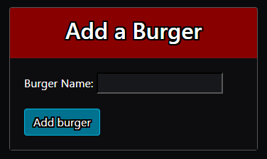
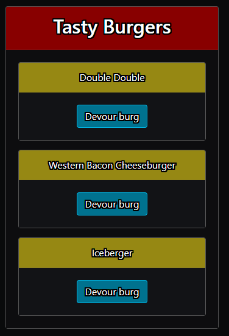
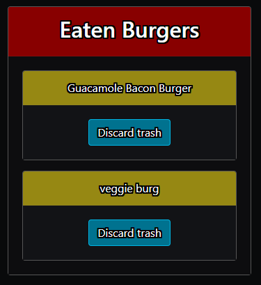

# burger

### User Instructions

1. Enter a burger name and click the "Add burger" button to add it to the "Tasty Burgers" panel.

2. From there, click the "Devour burg" button to eat it and send it to the "Eaten Burgers" panel.

3. Finally, click the "Discard trash" button to remove any and all remains of the burger.

